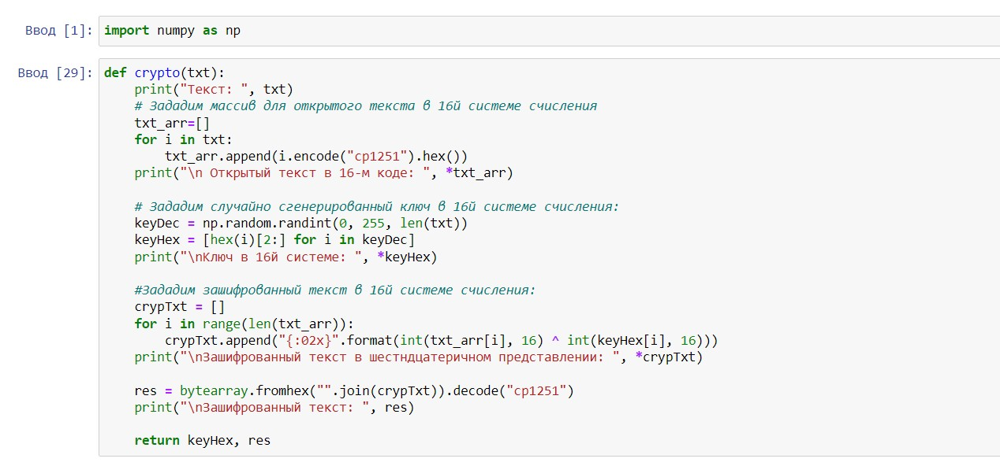
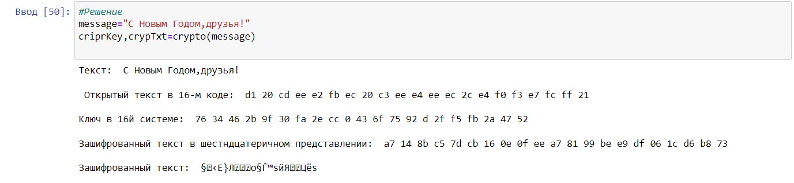
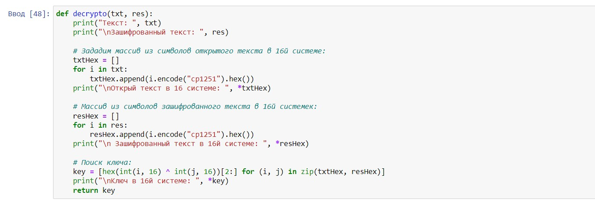
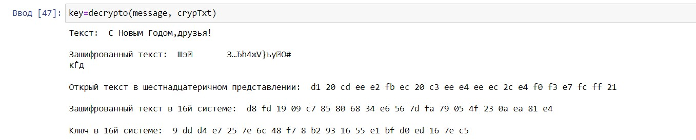

---
## Front matter
lang: ru-RU
title: Лабораторная работа №7
author: |
	Филиппова Вероника Сергеевна - студентка группы НКНбд-01-18
date: 11.12.2021

## Formatting
toc: false
slide_level: 2
theme: metropolis
header-includes:
 - \metroset{progressbar=frametitle,sectionpage=progressbar,numbering=fraction}
 - '\makeatletter'
 - '\beamer@ignorenonframefalse'
 - '\makeatother'
aspectratio: 43
section-titles: true
---

# Элементы криптографии. Однократное гаммирование

## Цель выполнения лабораторной работы

Освоить на практике применение режима однократного гаммирования

## Задачи выполнения работы

Нужно подобрать ключ, чтобы получить сообщение «С Новым Годом, друзья!». 
Требуется разработать приложение, позволяющее шифровать и дешифровать данные в режиме однократного гаммирования. 
Приложение должно:
1. Определить вид шифротекста при известном ключе и известном открытом тексте.
2. Определить ключ, с помощью которого шифротекст может быть преобразован в некоторый фрагмент текста, представляющий собой один из
возможных вариантов прочтения открытого текста.

## Результаты выполнения лабораторной работы. Часть 1

Написала функцию шифрования, которая определяет вид шифротекста при известном ключе и известном открытом тексте "С Новы Годом, друзья!". 

{ #fig:001 width=70% }
{ #fig:001 width=70% }

## Результаты выполнения лабораторной работы. Часть 2

Написала функцию дешифровки, которая определяет ключ, с помощью которого шифротекст может быть преобразован в некоторый фрагмент текста, представляющий собой один из возможных вариантов прочтения открытого текста.

{ #fig:002 width=70% }
{ #fig:002 width=70% }

## Выводы

Освоила на практике применение режима однократного гаммирования.

