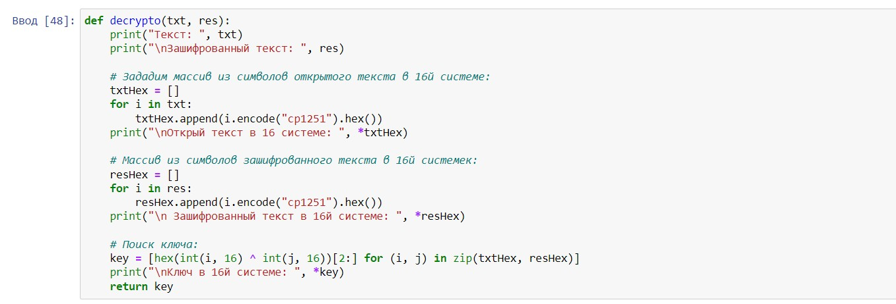
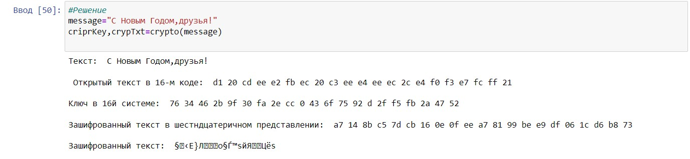
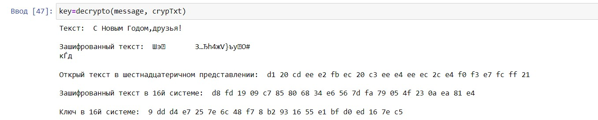

---
# Front matter
title: "Информационная безопасность."
subtitle: "Лабораторная работа №7."
author: "Филиппова Веорника Сергеевна."

# Generic otions
lang: ru-RU
toc-title: "Содержание"

# Bibliography

# Pdf output format
toc: true # Table of contents
toc_depth: 2
lof: true # List of figures
lot: true # List of tables
fontsize: 12pt
linestretch: 1.5
papersize: a4
documentclass: scrreprt
## I18n
polyglossia-lang:
  name: russian
  options:
  - spelling=modern
  - babelshorthands=true
polyglossia-otherlangs:
  name: english
### Fonts
mainfont: PT Serif
romanfont: PT Serif
sansfont: PT Sans
monofont: PT Mono
mainfontoptions: Ligatures=TeX
romanfontoptions: Ligatures=TeX
sansfontoptions: Ligatures=TeX,Scale=MatchLowercase
monofontoptions: Scale=MatchLowercase,Scale=0.9
## Biblatex
biblatex: true
biblio-style: "gost-numeric"
biblatexoptions:
  - parentracker=true
  - backend=biber
  - hyperref=auto
  - language=auto
  - autolang=other*
  - citestyle=gost-numeric
## Misc options
indent: true
header-includes:
  - \linepenalty=10 # the penalty added to the badness of each line within a paragraph (no associated penalty node) Increasing the value makes tex try to have fewer lines in the paragraph.
  - \interlinepenalty=0 # value of the penalty (node) added after each line of a paragraph.
  - \hyphenpenalty=50 # the penalty for line breaking at an automatically inserted hyphen
  - \exhyphenpenalty=50 # the penalty for line breaking at an explicit hyphen
  - \binoppenalty=700 # the penalty for breaking a line at a binary operator
  - \relpenalty=500 # the penalty for breaking a line at a relation
  - \clubpenalty=150 # extra penalty for breaking after first line of a paragraph
  - \widowpenalty=150 # extra penalty for breaking before last line of a paragraph
  - \displaywidowpenalty=50 # extra penalty for breaking before last line before a display math
  - \brokenpenalty=100 # extra penalty for page breaking after a hyphenated line
  - \predisplaypenalty=10000 # penalty for breaking before a display
  - \postdisplaypenalty=0 # penalty for breaking after a display
  - \floatingpenalty = 20000 # penalty for splitting an insertion (can only be split footnote in standard LaTeX)
  - \raggedbottom # or \flushbottom
  - \usepackage{float} # keep figures where there are in the text
  - \floatplacement{figure}{H} # keep figures where there are in the text
---

# Цель работы

Освоить на практике применение режима однократного гаммирования

# Задание
Нужно подобрать ключ, чтобы получить сообщение «С Новым Годом, друзья!». 
Требуется разработать приложение, позволяющее шифровать и дешифровать данные в режиме однократного гаммирования. 
Приложение должно:
1. Определить вид шифротекста при известном ключе и известном открытом тексте.
2. Определить ключ, с помощью которого шифротекст может быть преобразован в некоторый фрагмент текста, представляющий собой один из
возможных вариантов прочтения открытого текста.

# Выполнение лабораторной работы

Написала функцию шифрования, которая определяет вид шифротекста при известном ключе и известном открытом тексте "С Новы Годом, друзья!" 'crypto'. 

{ #fig:001 width=70% }

Написала функцию дешифровки, которая определяет ключ, с помощью которого шифротекст может быть преобразован в некоторый фрагмент текста, представляющий собой один из возможных вариантов прочтения открытого текста.

{ #fig:002 width=70% }

Проверка работы функции шифрования на примере из лабораторной работы

{ #fig:003 width=70% }

Результат функции шифрования. 

{ #fig:004 width=70% }

Результат функции дешифрования.

{ #fig:005 width=70% }

#Ответы на вопросы

1. Одократное гаммирование - выполнение операции XOR между элементами гаммы и элементами подлежащего сокрытию текста.  
Даже при раскрытии части последовательности гаммы нельзя получить информацию о всём скрываемом тексте.
2. Недостатки однократного гаммирования: Абсолютная стойкость шифра доказана только для случая, когда однократно используемый ключ, длиной, равной длине исходного сообщения, является фрагментом истинно случайной двоичной последовательности с равномерным законом распределения.
3. Преимущества однократного гаммирования: во-первых, такой способ симметричен, т.е. двойное прибавление одной и той же величины по модулю 2 восстанавливает исходное значение; во-вторых, шифрование и расшифрование может быть выполнено одной и той же программой. 
Наконец, Криптоалгоритм не даёт никакой информации об открытом тексте: при известном зашифрованном сообщении C все различные ключевые последовательности K возможны и равновероятны, а значит, возможны и любые сообщения P.
4. Длина открытого текста должна совпадать с длиной ключа, т.к. если ключ короче текста, то операция XOR будет применена не ко всем элементам и конец сообщения будет не закодирован, а если ключ будет длиннее, то появится неоднозначность декодирования.
5. Операция XOR используется в режиме однократного гаммирования. Наложение гаммы по сути представляет собой выполнение побитовой операции сложения по модулю 2, т.е. мы должны сложить каждый элемент гаммы с соответствующим элементом ключа. Данная операция является симметричной, так как прибавление одной и той же величины по модулю 2 восстанавливает исходное значение.
6. Получение шифротекста по открытому тексту и ключу: $C_i = P_i \oplus K_i$
7. Получение ключа по окрытому тексту и шифротексту: $K_i = P_i \oplus C_i$
8. Необходимы и достаточные условия абсолютной стойкости шифра: 
	- полная случайность ключа; 
	- равенство длин ключа и открытого текста; однократное использование ключа.
	
# Выводы

Освоила на практике применение режима однократного гаммирования.